# Portfólio

Welcome to **my portfolio**! Here you will find a collection of my projects, skills, experiences and my contacts, links and some of my projects.

## 🔧 Technologies Used

- **HTML5 & CSS3:** For structure and style.
- **JavaScript:** For animations and dynamic interactions.
- **AOS (Animate on Scroll):** For animations when scrolling the page.
- **Bootstrap Icons:** Ready-to-use icons for a richer interface.

## 👨‍🏫 About me

I am an extremely creative person, driven by a passion for solving problems and the combination of entrepreneurship and technology. My true calling is innovation and digital transformation.

At 30 years old, I live in Brazil, and I consider myself a highly communicative professional, with solid training in soft skills. I have more than 1 year of experience in web development, focusing on Angular, using mainly TypeScript and Node.js. 

I am also an active participant in developer communities, always looking for new challenges and contributing to the technological ecosystem.

## Projects

Here are some of my projects.

## Skills

- Angular
- JavaScript
- TypeScript
-HTML
-CSS
- TAILWIND
- BOOTSTRAP
- CHATGPT and AI
- TESTS WITH JEST
- WORDPRESS
- FIGMA and DESIGN FUNDAMENTALS
- SCRUM and KANBAN
- SEO and ACCESSIBILITY  
- GIT and GITHUB
- DATA MODELING
- MARIA DB | MySQL
- SWAGGER
- AWS FUNDAMENTALS
- OS: WINDOWS and LINUX
- MICROSERVICES | SOFTWARE ARCHITECTURE

## 📋 How to Use

1. **Clone the Repository**
   git clone https://github.com/AndressaTurchetto/andressa.git

## Contato

Se você deseja entrar em contato, fique à vontade para me enviar um e-mail para and.turchetto@gmail.com ou me encontrar nas redes sociais:

**LinkedIn:** [LinkedIn](https://www.linkedin.com/in/andressadev/)
**GitHub:** [GitHub](https://github.com/AndressaTurchetto/)

Obrigado por visitar meu portfólio!

## Capturas de Tela

Aqui estão algumas capturas de tela do meu portfólio:

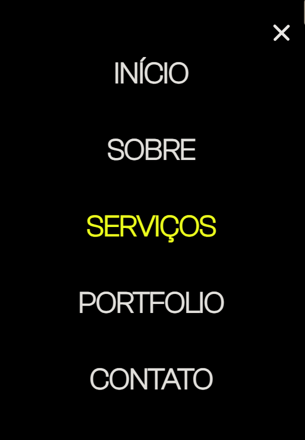
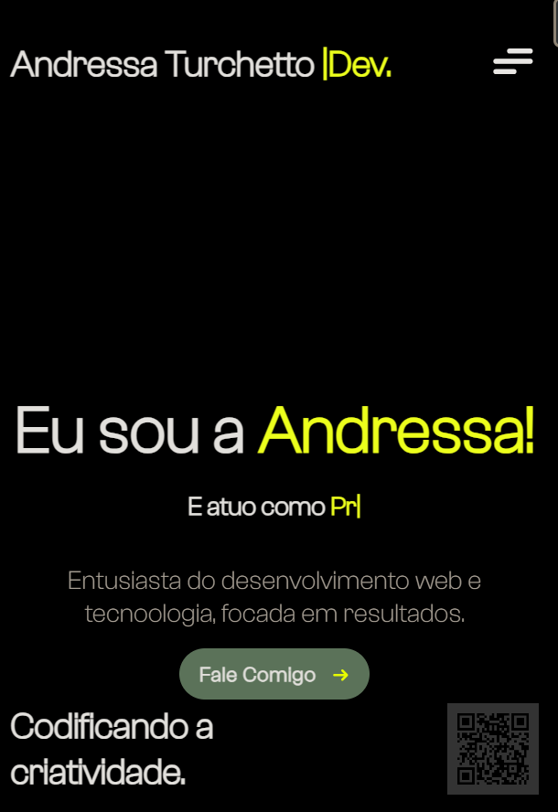
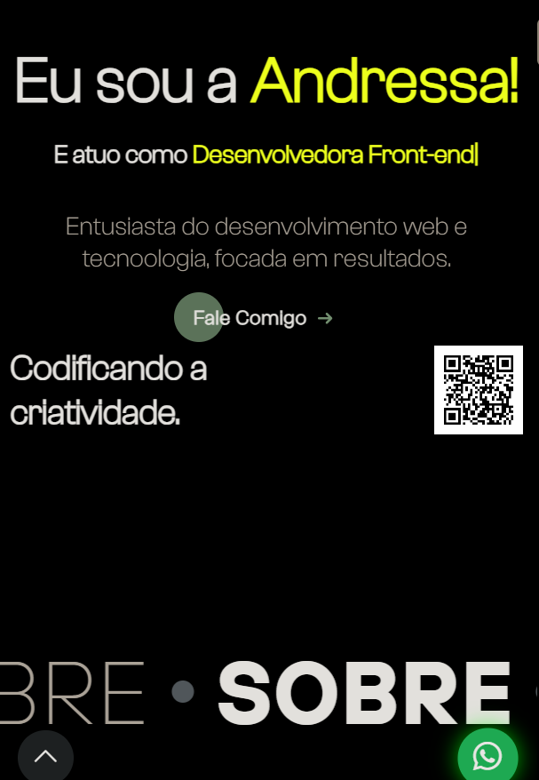
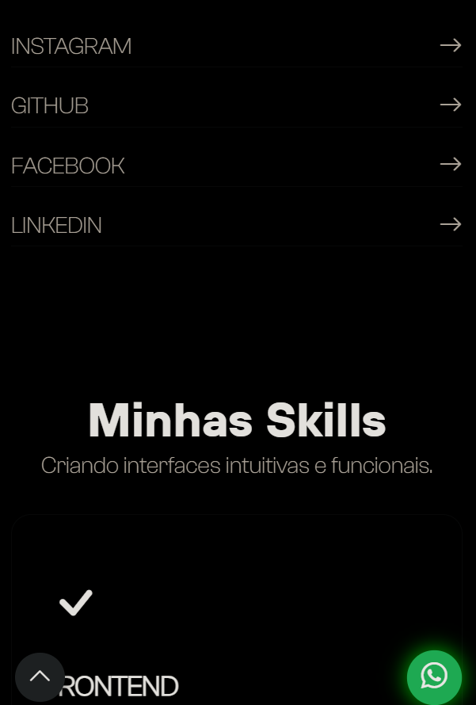
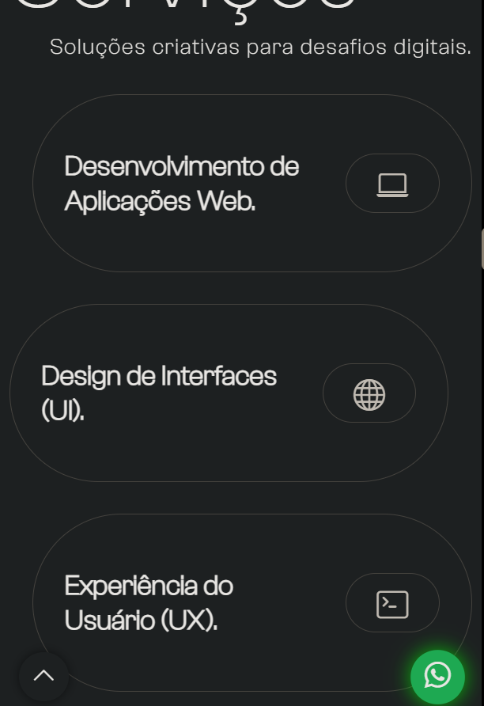
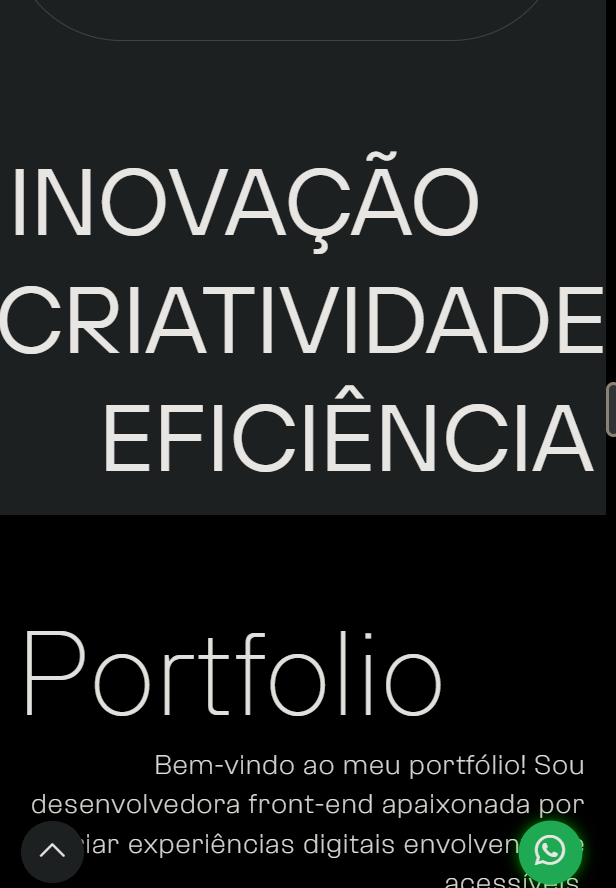
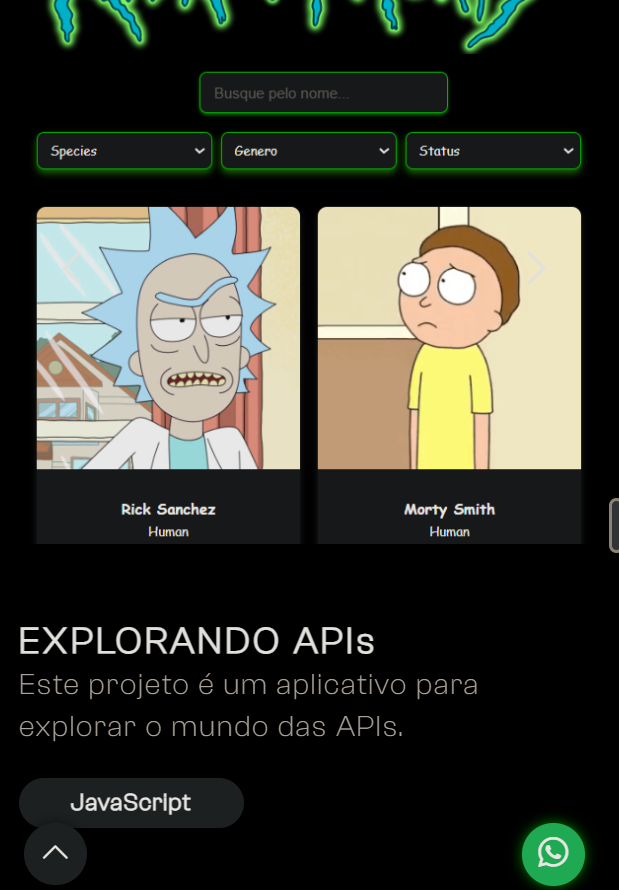
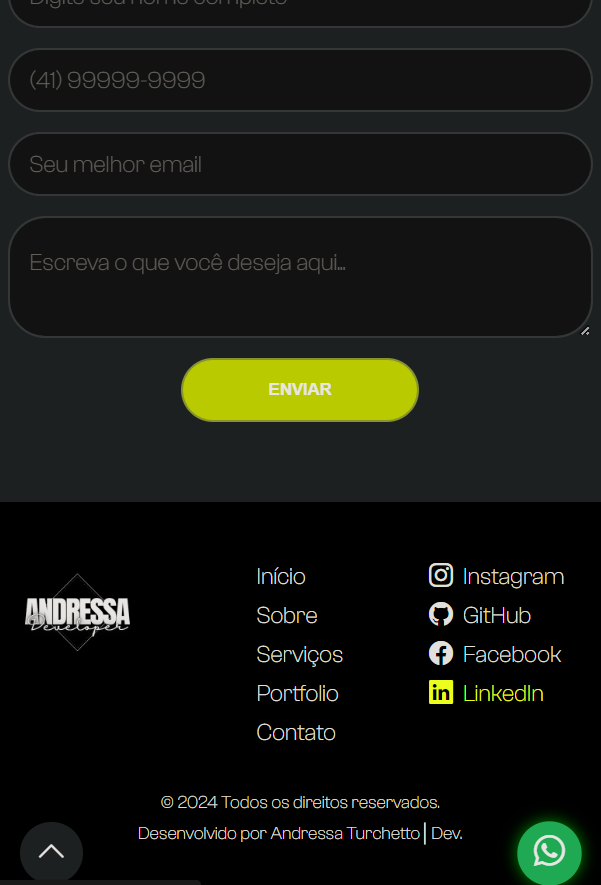
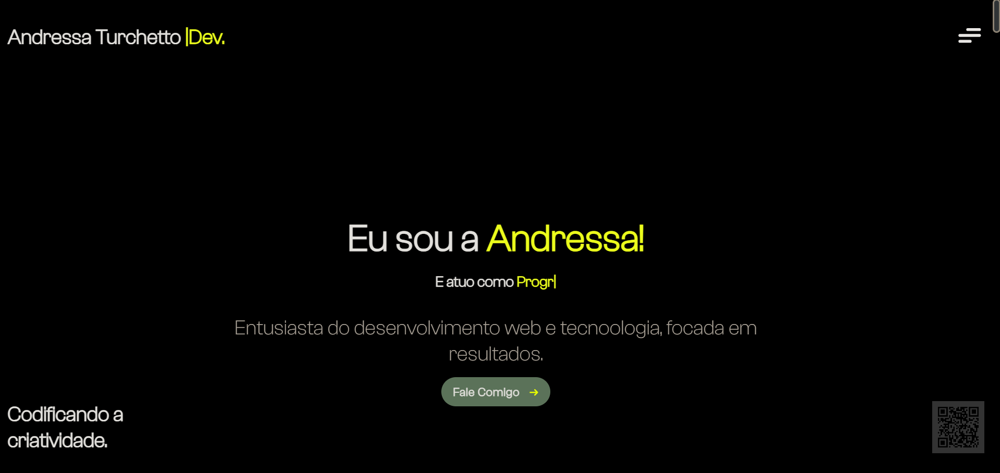
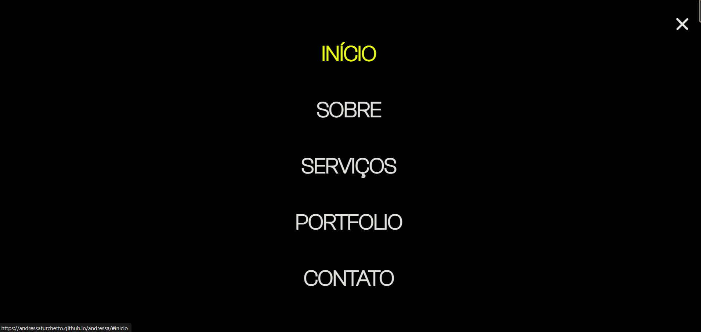
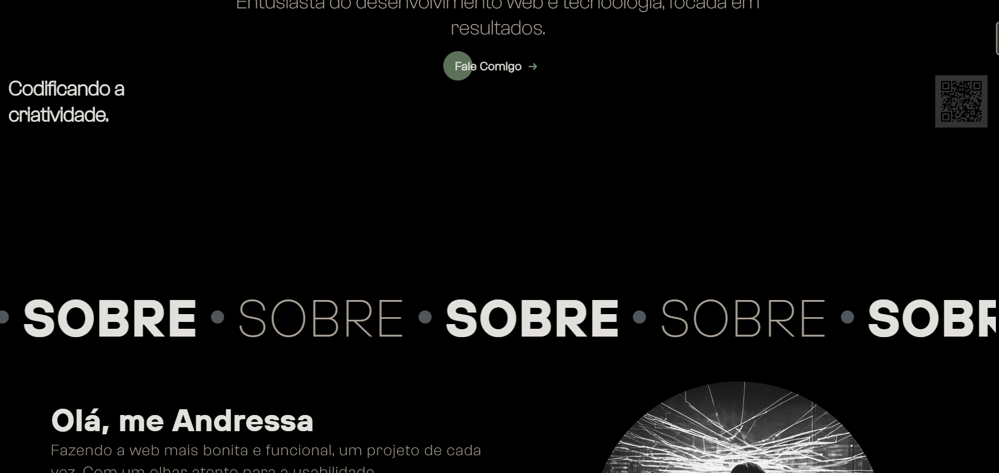
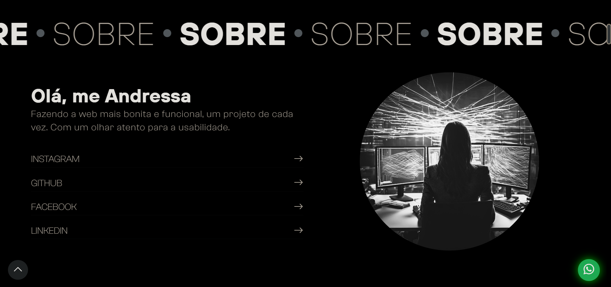
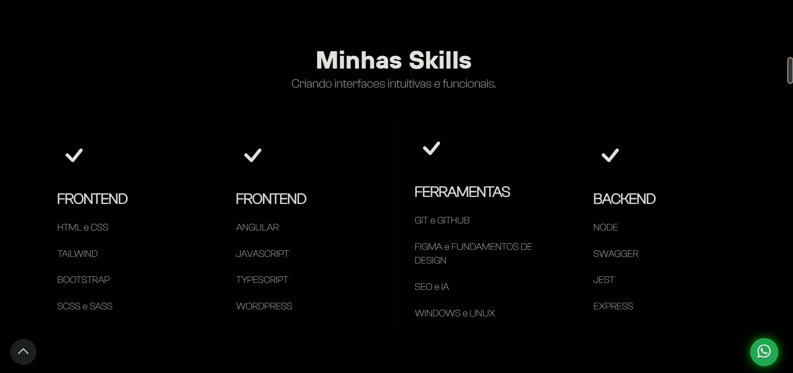
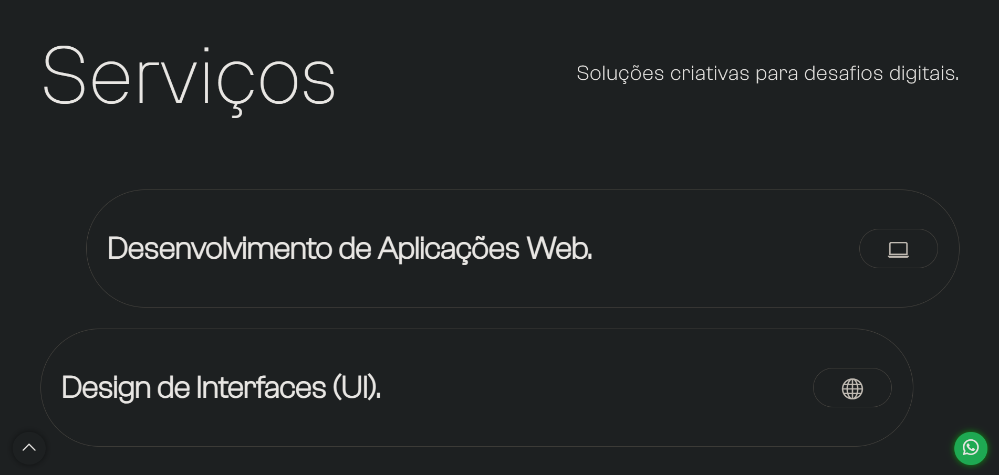
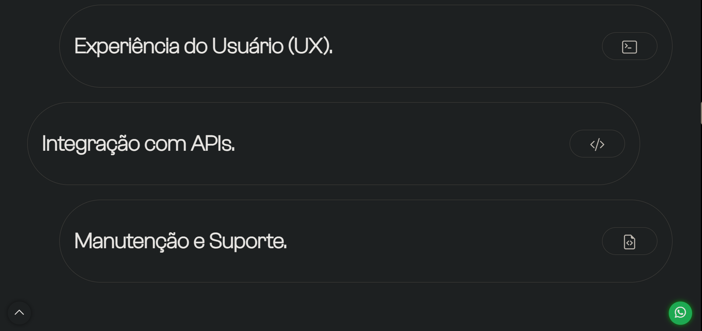
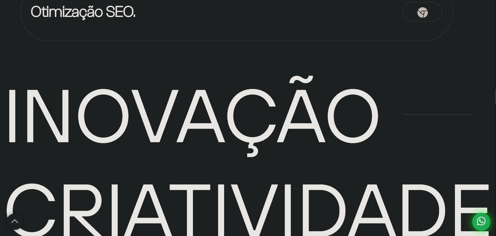
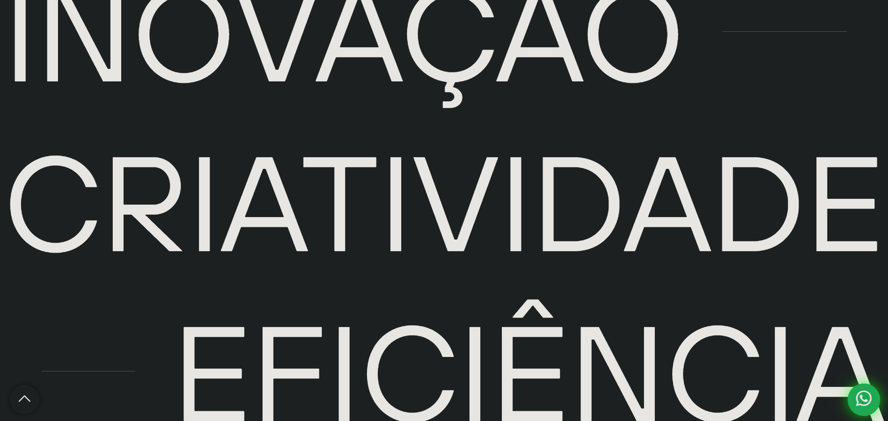
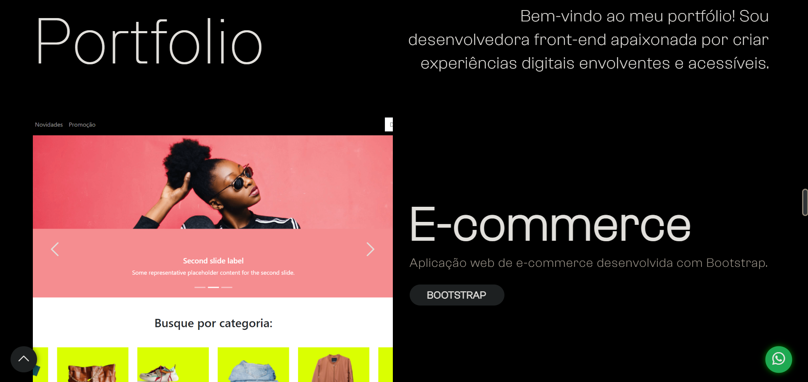

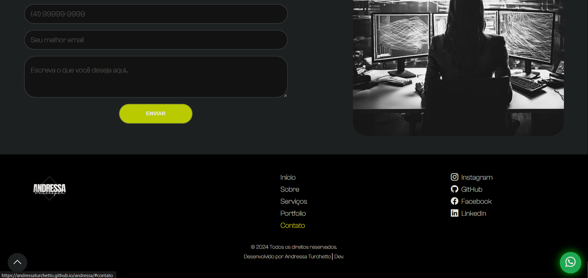